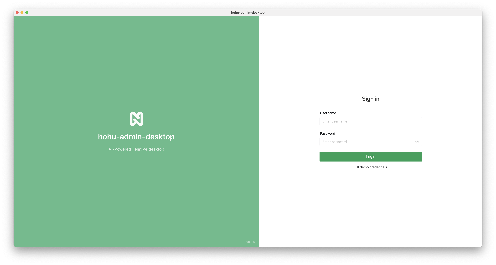
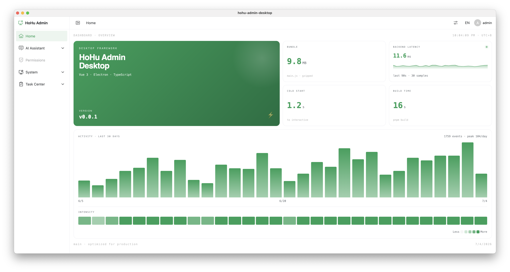
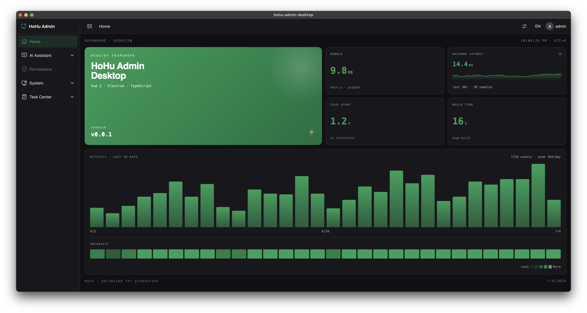

# HoHu Admin Desktop

<p align="center">
  <b>Electron + Vue 3 desktop application framework · hohu ecosystem</b>
</p>

<p align="center">
  <a href="https://github.com/aihohu/hohu-admin">Backend</a> ·
  <a href="https://github.com/aihohu/hohu-admin-web">Web Frontend</a> ·
  <a href="https://github.com/aihohu/hohu-admin-app">Mobile App</a> ·
  <a href="./docs/framework-design.md">Design Doc</a>
</p>

<p align="center">
  
  
  
  
  
  
  =20-339933.svg" alt="Node.js" />
  =10.5-F69220.svg" alt="pnpm" />
</p>

---

## Screenshots

<p align="center">
  
  
  
</p>

## Introduction

**hohu-admin-desktop** is an open-source **Electron + Vue 3 desktop application framework**. It pairs with [hohu-admin-web](https://github.com/aihohu/hohu-admin-web) (browser) and [hohu-admin-app](https://github.com/aihohu/hohu-admin-app) (mobile) to form the hohu ecosystem — all three front-ends consume the same [hohu-admin](https://github.com/aihohu/hohu-admin) FastAPI backend.

> **Positioning:** a developer scaffold, not an end-user product. Clone it to build desktop apps with full hohu-admin backend integration, or use it as a reference architecture for any Electron + Vue 3 + TypeScript project.

Designed for AI-first development: typed IPC, explicit contracts between processes, and conventional structure make it easy to extend with AI-assisted coding tools.

## Features

### Foundation (Phase 1)

- **Main-process HTTP forwarder** — All network requests route through Electron's `net` module via typed IPC, **bypassing browser CORS** without disabling security. Standard pattern used by VS Code / Slack / GitHub Desktop.
- **Secure token storage** — JWT tokens encrypted by the OS keychain (macOS Keychain / Windows DPAPI / Linux libsecret) via Electron `safeStorage`, never written to `localStorage`.
- **Typed IPC bridge** — Shared types in `src/shared/types.ts` flow through all three processes (main / preload / renderer) with zero `any`.
- **Auth flow** — JWT login, single-flight token refresh, auto-login on app start.
- **Flat request shape** — `const { data, error } = await fetchLogin(...)` — no try/catch needed.
- **Dynamic routes + RBAC** — Backend-driven menu, glob component mapping, memory history, dual-mode (dynamic/static), `v-permission` directive + `hasAuth()` + `TableHeaderOperation`.
- **Layout + theme + i18n** — dark mode (synced to `nativeTheme`), primary color presets, zh-cn / en-us, breadcrumb, sider collapse.
- **Naive UI integrated** — Providers, composables (`useMessage`, `useDialog`, `useNotification`) ready to use.

### Desktop differentiation (Phase 2)

- **Unified logging** (`electron-log`) — main / preload / renderer all write to `~/Library/Logs/{appName}/` (macOS) or platform equivalent.
- **Persistent config** (`electron-store`) — window state, shortcuts, tray behavior, notification toggle, etc. persisted to `userData/config.json`.
- **Window manager** — main-window singleton, window state (position, size, maximized, fullscreen) persists across restarts.
- **System tray** — tray icon + right-click menu (Show/Hide / Reload / DevTools / Check for Updates / Quit); close button minimizes to tray.
- **Global shortcuts** — default `Cmd/Ctrl+Shift+H` summons the window, configurable via IPC.
- **Auto-updater** (`electron-updater` v6) — dual provider (GitHub Releases / Generic static URL), 24h background check throttle, skip-version, dev mode reads `dev-app-update.yml`.
- **Notification dispatcher** — every `new Notification()` routed through one manager; renderer pushes via `window.api.notification.show()`; GC-safe retention, global mute, action callback hooks.

> See [`docs/framework-design.md`](./docs/framework-design.md) for the full roadmap and per-phase specs.

## Tech Stack

| Category           | Technology                                       |
| ------------------ | ------------------------------------------------ |
| Shell              | Electron 39                                      |
| Build Tool         | electron-vite 5 (Vite 7 under the hood)          |
| Framework          | Vue 3 (Composition API, `<script setup>`)        |
| Language           | TypeScript 5.9 (strict)                          |
| UI Library         | NaiveUI 2.44                                     |
| State              | Pinia 3                                          |
| HTTP Transport     | Electron `net` (via typed IPC, no axios)         |
| Main-process libs  | electron-log / electron-store / electron-updater |
| Form Serialization | `qs` (main process only)                         |

## Architecture

```
┌─────────────────────────────────────────────────────────────┐
│ Renderer (browser-like)                                     │
│   Vue 3 + Pinia + NaiveUI                                   │
│      │                                                       │
│      │ window.api.http.request(config)                       │
│      ▼                                                       │
├─────────────────────────────────────────────────────────────┤
│ Preload (sandboxed bridge)                                  │
│   contextBridge → exposes strict whitelist API              │
│      │                                                       │
│      │ ipcRenderer.invoke('http:request', config)            │
│      ▼                                                       │
├─────────────────────────────────────────────────────────────┤
│ Main (Node.js runtime — no CORS)                            │
│   ipcMain.handle → net.request → backend                    │
│   secureStore → safeStorage → OS keychain                   │
│   WindowManager / TrayManager / ShortcutManager /           │
│   UpdaterManager / NotificationManager                      │
└─────────────────────────────────────────────────────────────┘
                          │
                          ▼
                hohu-admin FastAPI backend
```

Shared types (`src/shared/types.ts`) are imported by all three processes via the `@shared/*` alias.

## Quick Start

### Prerequisites

- Node.js ≥ 20.19
- pnpm ≥ 10.5
- A running [hohu-admin](https://github.com/aihohu/hohu-admin) backend (default: `http://127.0.0.1:8000`)

### Install

```bash
pnpm install
```

### Develop

```bash
pnpm dev
```

The renderer boots on `http://localhost:5173`; the Electron window opens automatically. Main-process changes require restarting dev (HMR only covers the renderer).

### Build

```bash
# Windows (.exe NSIS installer)
pnpm build:win

# macOS (.dmg)
pnpm build:mac

# Linux (.AppImage / .deb / .snap)
pnpm build:linux

# Debug build without packaging
pnpm build:unpack
```

Artifacts land in `release/`.

### Quality Gates

```bash
pnpm typecheck   # tsc (node) + vue-tsc (web)
pnpm lint        # ESLint
pnpm test        # node:test + tsx (pure-function unit tests)
pnpm fmt         # Prettier check (CI gate)
pnpm format      # Prettier auto-format
```

## Project Structure

```
src/
├── main/              # Main process (Node.js)
│   ├── index.ts       # App lifecycle, window, IPC registration
│   ├── services/      # WindowManager / TrayManager / ShortcutManager /
│   │                  # UpdaterManager / NotificationManager / http / secure-store
│   └── ipc/           # ipcMain.handle registrations (typed)
├── preload/           # Sandboxed bridge
│   ├── index.ts       # contextBridge whitelist
│   └── index.d.ts     # Window.api types
├── renderer/          # Renderer process (Vue 3)
│   └── src/
│       ├── views/         # Pages (login, home, _builtin)
│       ├── components/
│       ├── store/         # Pinia (auth, theme, app, route)
│       ├── service/       # Request factory + API wrappers
│       ├── locales/       # zh-cn / en-us
│       ├── typings/       # Api.* namespaces
│       └── main.ts
└── shared/            # Cross-process types (HttpConfig, AppApi, ...)
```

Path aliases: `@renderer/*`, `@shared/*`, `@main/*`, `@resources/*` (configured in `tsconfig.*.json` and `electron.vite.config.ts`).

## Backend Integration

| Item            | Value                                    |
| --------------- | ---------------------------------------- |
| API Base (dev)  | `http://127.0.0.1:8000`                  |
| API Base (prod) | `https://api.hohu.org`                   |
| Auth            | `Authorization: Bearer <token>`          |
| Response shape  | `{ code: number, msg: string, data: T }` |
| Success code    | `200`                                    |

Auth endpoints:

- `POST /auth/login` → `{ token, refreshToken }`
- `POST /auth/refreshToken` → `{ token, refreshToken }`
- `GET /auth/getUserInfo` → `{ userId, userName, roles, buttons, ... }`

## Documentation

- [`CLAUDE.md`](./CLAUDE.md) — Project conventions, architecture decisions, common pitfalls (read this first when contributing)
- [`docs/framework-design.md`](./docs/framework-design.md) — Full design rationale, three-phase roadmap, what-not-to-do list
- Per-phase specs: `docs/spec-phase1-routes-rbac.md`, `docs/spec-phase2.{1,2,3,4}-*.md`

## Platform Support

| Platform | Auto-Update                                                                                                            | System Notifications                                               |
| -------- | ---------------------------------------------------------------------------------------------------------------------- | ------------------------------------------------------------------ |
| Windows  | ✅ NSIS, works out of the box                                                                                          | ✅                                                                 |
| macOS    | ⚠️ Requires code signing (Developer ID Application cert). Without it, can detect and download but install is rejected. | ✅                                                                 |
| Linux    | ✅ AppImage (deb / snap don't support auto-update)                                                                     | ⚠️ Requires libnotify; no-op in containers / headless environments |

Notarization is Apple's independent requirement for **first-time distribution**, unrelated to the auto-update flow. Neither signing nor notarization is configured by default — developers set these up when shipping their own apps.

## Contributing

See [`CONTRIBUTING.md`](./CONTRIBUTING.md). PRs against `main` are welcome. Conventional Commits enforced; pre-commit hook runs `typecheck && lint && fmt && git diff --exit-code`.

## Security

Found a vulnerability? See [`SECURITY.md`](./SECURITY.md) for disclosure.

## Changelog

See [`CHANGELOG.md`](./CHANGELOG.md).

## License

[MIT](./LICENSE) © HoHu
